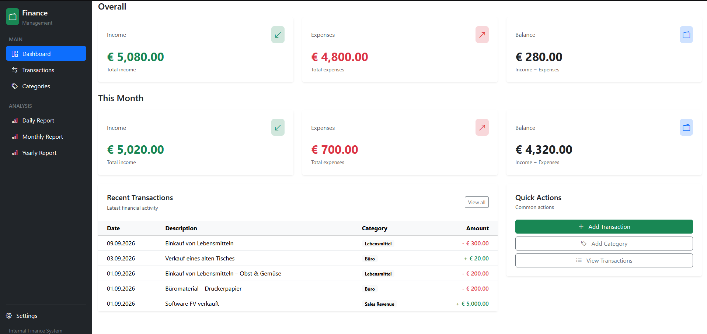

# Personal Finance Management System

A personal finance management application built with Symfony and MySQL, using Docker for a containerized development environment.

Users can manage income and expenses, organize transactions by category, and analyze their financial activity through daily, monthly, and yearly reports.

## Overview

This application allows users to manage their personal finances by recording income and expenses, organizing transactions into categories, and analyzing financial activity over different time periods.

## Screenshots

### Dashboard

## Features

- Create and manage income and expense transactions
- Create and manage transaction categories
- Search transactions by description
- Filter transactions by type, category, and date range
- View financial statistics on the dashboard
- View category-based daily, monthly, and yearly reports
- Visualize transactions using category colors
- Responsive user interface

## Technologies

### Backend

- PHP 8.3
- Symfony 7.4
- Doctrine ORM

### Database

- MySQL

### Frontend

- Twig
- Bootstrap

### Infrastructure

- Apache
- Docker
- Docker Compose

## Requirements

- Docker
- Docker Compose
- Git

## Installation

### 1. Clone the repository

    git clone https://github.com/h-s-ner/personal-finance-manager.git
    cd personal-finance-manager

### 2. Configure the environment

Copy the example environment files:

    cp application/.env.example application/.env
    cp docker/.env.example docker/.env

Configure the Docker environment in `docker/.env`.

The local application URL can be configured with `COMPOSE_PROJECT_URL`, for example:

    COMPOSE_PROJECT_URL=pfm.local

Database connection settings can also be configured in `docker/.env`.

### 3. Generate the SSL certificate

    make generate-ssl

The certificate must be generated before building the Docker containers.

### 4. Build and start the containers

    make build
    make up

### 5. Install dependencies

    make composer-install

### 6. Run database migrations

    make symfony CMD="doctrine:migrations:migrate"

The application is now ready to use.

## Future Plans

- Integrate jQuery DataTables to add pagination and sorting to transaction and category tables

## License

Copyright (c) 2026 h-s-ner

All rights reserved.

This project is provided for portfolio and demonstration purposes only.

The source code may be viewed for evaluation purposes. No permission is
granted to copy, modify, distribute, sublicense, publish, or use this
software, or substantial portions of it, for commercial or other purposes
without prior written permission.
